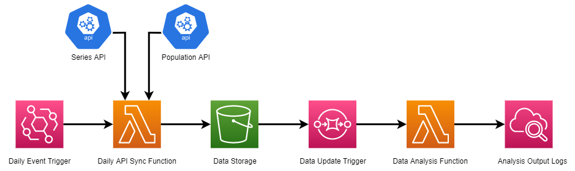

# Rearc Data Quest

The following are notes/steps I took when exploring [rearc-data/quest](https://github.com/rearc-data/quest). Note that I'm new to some of these technologies and procedures, and that some of these notes may be over-detailed but were useful for my reference while exploring the data quest.

## Part 1: AWS S3 & Sourcing Datasets

> 1. Republish [this open dataset](https://download.bls.gov/pub/time.series/pr/) in Amazon S3 and share with us a link.

- Made a publicly accessible bucket on Amazon S3. Here's a file listing: [].
- Downloaded and uploaded files from the open dataset to the S3 bucket.
- Changed permissions by turning off "Block public access" and editing the bucket policy. Completed these steps while following [this guide](https://www.simplified.guide/aws/s3/create-public-bucket) to provide read-only permissions to users. Here's the bucket policy:

```json
{
  "Version": "2012-10-17",
  "Statement": [
    {
      "Sid": "AddPerm",
      "Principal": "*",
      "Effect": "Allow",
      "Action": "s3:GetObject",
      "Resource": "arn:aws:s3:::data-quest-bucket/*"
    }
  ]
}
```

> 2. Script this process so the files in the S3 bucket are kept in sync with the source when data on the website is updated, added, or deleted.

- Made a Python script `sync_data.py` to sync data source with S3 bucket.
- Based on part 4 question 2, I would be running this script on a daily basis. Locally I would use [Windows Task Scheduler](https://www.geeksforgeeks.org/schedule-a-python-script-to-run-daily/).
- Set up a virtual environment to use packages:
  - `boto3`
  - `bs4`
  - `requests`
- References
  - [RealPython Web Scraping with Python article - BeautifulSoup4 HTML Parser](https://realpython.com/python-web-scraping-practical-introduction/#use-an-html-parser-for-web-scraping-in-python)
  - [RealPython Boto3 and AWS S3 article](https://realpython.com/python-boto3-aws-s3/)
  - [Boto3 Docs - S3 service reference](https://boto3.amazonaws.com/v1/documentation/api/latest/reference/services/s3.html)

> 3. Don't rely on hard coded names - the script should be able to handle added or removed files.

- The script implementation only specifies `a` elements to access each downloadable resource, not by specific file names.
- The script handles added or removed files.
- Based on the HTML of the data source, I would need to specify which `a` elements to include for upload.
- Assumptions:
  - There is an `a` element with text content `[To Parent Directory]` which will be omitted from processing within the script.
  - No directories are on the data source page, only direct files.

> 4. Ensure the script doesn't upload the same file more than once.

The script logic prevents uploading the same file more than once since files in the data source and their corresponding S3 object keys have the same name. This helps check if a file exists as an S3 object since the object key is unique in an S3 bucket.

Script logic:

- If data source file not in S3
  - Upload to S3
- If data source file in S3
  - If data source file differs from S3 file
    - Update S3 file
  - If data source file is the same as S3 file
    - Do nothing
- Remove S3 files that don't exist in data source

## Part 2: APIs

> 1. Create a script that will fetch data from [this API](https://datausa.io/api/data?drilldowns=Nation&measures=Population). You can read the documentation [here](https://datausa.io/about/api/)

- Made a Python script `fetch_data.py` to fetch and upload API data to S3.
- [Found a typo](https://github.com/DataUSA/datausa-site/pull/972) on the API page.

> Save the result of this API call as a JSON file in S3.

- Noticed that the `sync_data.py` script from part 1 would remove the JSON file in S3 since it doesn't exist on the first data source website, so I added an exception in `sync_data.py` for the object `population-data.json`.
- Used packages `boto3` and `requests` to fetch the API data and upload it as a JSON file to S3.

## Part 3: Data Analytics

### Step 0

> Load both the csv file from Part 1 pr.data.0.Current and the json file from Part 2 as dataframes (Spark, Pyspark, Pandas, Koalas, etc).

- Analyzed data with results in a Jupyter Notebook.
- Used packages `pandas` and `requests` to load csv and json data. I noticed that for the part 2 dataframe I only needed the data section of the JSON file, so I learned to load the JSON file with [this StackOverflow answer](https://stackoverflow.com/a/62930034) and how to grab the specific nested data with [this article](https://towardsdatascience.com/how-to-convert-json-into-a-pandas-dataframe-100b2ae1e0d8).
- Loaded data from S3 bucket. Had 403 errors when trying to load from the second data source on the original API.

### Step 1

> Using the dataframe from the population data API (Part 2), generate the mean and the standard deviation of the US population across the years [2013, 2018] inclusive.

- Filtered the population data within the [2013, 2018] inclusive year range ([reference](https://realpython.com/pandas-python-explore-dataset/#querying-your-dataset)).
- Converted the `Years` column from an `object` `dtype` to `int` using `astype()` ([reference](https://stackoverflow.com/a/39216001)).
- Used `mean()` and `std()` on the filtered dataframe's `Population` column.

### Step 2

> Using the dataframe from the time-series (Part 1), For every series_id, find the best year: the year with the max/largest sum of "value" for all quarters in that year. Generate a report with each series id, the best year for that series, and the summed value for that year.

- Used [`rename()`](https://pandas.pydata.org/docs/reference/api/pandas.DataFrame.rename.html) to by removing whitespace in `series_id` and `value` original column names.
- Used [`groupby()`](https://pandas.pydata.org/docs/reference/api/pandas.DataFrame.groupby.html) and [sorting values to remove all but the year with the max summed value](https://stackoverflow.com/a/45999101) for each series.

### Step 3

> Using both dataframes from Part 1 and Part 2, generate a report that will provide the value for series_id = PRS30006032 and period = Q01 and the population for that given year (if available in the population dataset).

- Filtered series dataframe for the given `series_id` and `period`.
- Extracted the population from the `population` dataframe and converted its `Year` column into an `int` type for merging.
- Merged and filtered results for output, where population is displayed where it exists.

### Step 4

> Submit your analysis, your queries, and the outcome of the reports as a .ipynb file.

`data_analytics.ipynb` is located in the `part3` directory.

## Part 4: Infrastructure as Code & Data Pipeline with AWS CDK

- Before attempting this part, I went through the [ZTM Terraform course](https://zerotomastery.io/courses/learn-terraform-certification/) to learn more (i.e. using modules).
- I also tried setting up the infrastructure within the AWS Management Console before attempting the IaC to base the code off of. This step involved referencing certain guides when encountering challenges such as:
  - [Understanding how to integrate SQS with S3](https://www.youtube.com/watch?v=ZDHy3pwJnyo)

### Step 0

- Used Terraform for an automated data pipeline on AWS.

### Step 1

- Combined part 1 and part 2 scripts into one lambda function for daily API data sync with an S3 bucket for storage and access.
- Used environment variables to get randomly generated S3 bucket names for updating S3 data by using the `os` package to get environment variables.
- Created an EventBridge scheduled event that runs daily to trigger the lambda function for keeping data up to date. Followed [this reference article](https://openupthecloud.com/terraform-lambda-scheduled-event/).
- Zipped required dependencies and script in `/part4/terraform_IaC/scripts`. For ease of viewing the actual script check `/part4/daily_lambda.py`.

### Step 2

- Set up an S3 event notification everytime `population-data.json` is updated/written to S3, which adds to an SQS queue. Followed [this reference in the Terraform Registry](https://registry.terraform.io/providers/hashicorp/aws/latest/docs/resources/s3_bucket_notification#add-notification-configuration-to-sqs-queue).

### Step 3

- Set up a lambda function that runs data analysis on the stored data (based on part 3 Jupyter Notebook). Used environment variables for the S3 bucket name.
- Zipped required dependencies and script in `/part4/terraform_IaC/scripts`. For ease of viewing the actual script check `/part4/analysis_lambda.py`.
- Used [draw.io](https://draw.io/) just to visualize what the infrastructure looks like:


